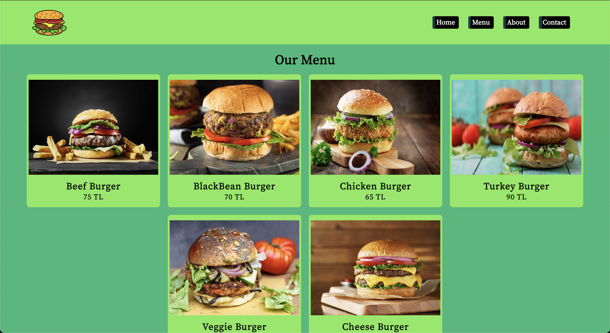

# React Simple Multi-Page Application

This project is a simple multi-page web application built with React. It includes four main pages: **Home**, **Menu**, **About**, and **Contact**. The navigation between pages is handled using React Router DOM, and icons are integrated with React Icons. Styling is implemented via `index.css`.

## Screenshots 🖼️

### Video GIF


### Mainpage


### Menu



### About


### Contact


## Technologies Used

- **React**: For building the user interface.
- **Vite**: For a fast and modern development environment.
- **React Router DOM**: For page navigation and routing.
- **React Icons**: For adding icons to the application.
- **CSS (index.css)**: For styling and design adjustments.

## Installation

1. Clone the repository:
   ```
   git clone https://github.com/ozerbaykal/react-burger.git
   cd react-burger
   ```
2. Install dependencies:

```
npm install

```

3. Run the development server:

```
npm run dev

```

## Contributing

Contributions are welcome! Please open an issue first to discuss what you would like to change.

- 1.Fork the project
- 2.Create your feature branch (git checkout -b feature/NewFeature)
- 3.Commit your changes (git commit -m 'Add new feature')
- 4.Push to the branch (git push origin feature/NewFeature)
- 5.Open a Pull Request

## Contact 📬

**Özer BAYKAL**  
Email: [baykalozer87@gmail.com](mailto:baykalozer87@gmail.com)  
Project Link: [Movie App on GitHub](https://github.com/ozerbaykal/react-burger)
